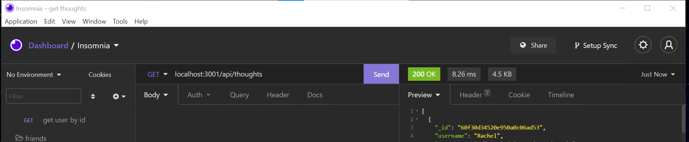

# **Rachel-s-Social-Network-API**

## **Table of Contents**

- [User Story](#user-story)
- [Github Profile](#github-profile)
- [Screencastify Links](#screencastify-links)
- [Contribution](#contribution)

### **User Story**

- AS A social media startup
- I WANT an API for my social network that uses a NoSQL database
- SO THAT my website can handle large amounts of unstructured data

### **Github Profile**

- https://github.com/rsolov23/Rachel-s-Social-Network-API
- https://github.com/rsolov23

### **Screencastify Links**

- https://drive.google.com/file/d/1-VtIBn1Yk43UaccVVerqYpSW9f2crDR1/view
- https://drive.google.com/file/d/1LcQRY_BGbyVUSh_g8Og7P9untoJZr6tH/view

### **Contribution**

Feel free to contribute to this project in any of the following ways:

- [Submit bug and feature requests](https://github.com/rsolov23/Rachel-s-Social-Network-API/issues)
- [Review Source Code Changes](https://github.com/rsolov23/Rachel-s-Social-Network-API/pulls) and make pull requests from typos to content

Copyright (c) 2021 Rachel Solov
